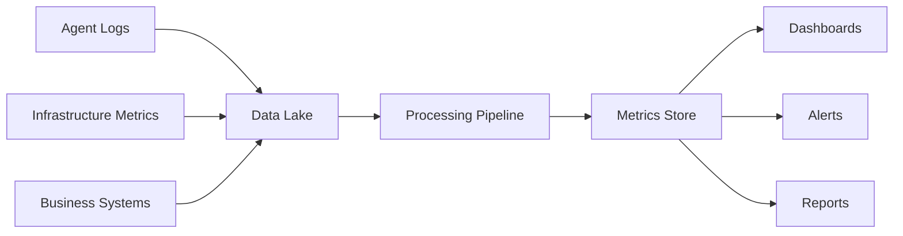

# BMAD Success Metrics & KPI Framework

## Executive Summary

This document defines the comprehensive success metrics and Key Performance Indicators (KPIs) for the BMAD (Breakthrough Method for Agile AI-Driven Development) implementation within Gemini Enterprise Architect.

## Metric Categories

### 1. DORA Metrics (Primary Engineering KPIs)

#### Deployment Frequency
**Definition:** How often code is deployed to production
**Target:** Daily deployments
**Current Baseline:** Weekly
**Measurement Method:** CI/CD pipeline tracking

```yaml
calculation: count(production_deployments) / time_period
data_source: Cloud Build / GitHub Actions
reporting_frequency: Daily
alert_threshold: < 0.5 deployments/day
```

#### Lead Time for Changes
**Definition:** Time from code commit to production deployment
**Target:** < 1 hour
**Current Baseline:** 3 days
**Measurement Method:** Git commit timestamp to deployment timestamp

```yaml
calculation: deployment_time - commit_time
data_source: Git + Deployment logs
reporting_frequency: Per deployment
alert_threshold: > 4 hours
```

#### Mean Time to Recovery (MTTR)
**Definition:** Time to restore service after an incident
**Target:** < 30 minutes
**Current Baseline:** 2 hours
**Measurement Method:** Incident start to resolution

```yaml
calculation: incident_resolved_time - incident_start_time
data_source: PagerDuty / Monitoring system
reporting_frequency: Per incident
alert_threshold: > 1 hour
```

#### Change Failure Rate
**Definition:** Percentage of deployments causing production failures
**Target:** < 5%
**Current Baseline:** 15%
**Measurement Method:** Failed deployments / Total deployments

```yaml
calculation: (failed_deployments / total_deployments) * 100
data_source: Deployment pipeline + Incident management
reporting_frequency: Weekly
alert_threshold: > 10%
```

### 2. Agent Performance Metrics

#### Agent Response Time
**Definition:** Time for agent to complete assigned task
**Target by Agent:**
- Analyst: < 2 minutes for research
- PM: < 5 minutes for story creation
- Architect: < 3 minutes for design review
- Developer: < 10 minutes for code generation
- QA: < 5 minutes for test creation
- Scout: < 1 minute for duplication check

```yaml
measurement:
  start: agent_request_received
  end: agent_response_delivered
  percentiles: [p50, p90, p99]
  alert: p90 > target * 1.5
```

#### Agent Success Rate
**Definition:** Percentage of successful agent completions
**Target:** > 95%
**Measurement:** Successful completions / Total requests

```yaml
success_criteria:
  - task_completed: true
  - no_errors: true
  - output_validated: true
  - user_accepted: true
```

#### Agent Utilization
**Definition:** Percentage of time agents are actively working
**Target:** 60-80% (avoiding overload)
**Measurement:** Active time / Available time

```yaml
states:
  active: processing_request
  idle: awaiting_request
  error: failure_state
  maintenance: updating_or_training
```

### 3. Quality Metrics

#### Code Quality Score
**Definition:** Composite score of code quality indicators
**Target:** > 85/100
**Components:**
- Test coverage: 30% weight
- Code complexity: 20% weight
- Documentation: 20% weight
- Security score: 20% weight
- Performance: 10% weight

```yaml
calculation:
  test_coverage: (covered_lines / total_lines) * 30
  complexity: (1 - (complex_functions / total_functions)) * 20
  documentation: (documented_functions / total_functions) * 20
  security: security_scan_score * 20
  performance: performance_benchmark_score * 10
```

#### Defect Density
**Definition:** Defects per thousand lines of code
**Target:** < 1 defect/KLOC
**Measurement:** Total defects / KLOC

#### Test Coverage
**Definition:** Percentage of code covered by tests
**Target:** > 80%
**Measurement:** Lines covered / Total lines

#### Technical Debt Ratio
**Definition:** Remediation cost / Development cost
**Target:** < 10%
**Measurement:** SonarQube technical debt calculation

### 4. Business Value Metrics

#### Feature Delivery Rate
**Definition:** Features delivered per sprint
**Target:** 5-8 features/sprint
**Measurement:** Completed features / Sprint

#### Time to Market
**Definition:** Idea to production deployment time
**Target:** < 2 weeks for standard features
**Measurement:** Production date - Request date

#### Development Cost Reduction
**Definition:** Cost savings vs traditional development
**Target:** 40% reduction
**Calculation:**
```
baseline_cost = developers * hours * rate
bmad_cost = (developers * hours * rate) * 0.6 + agent_infrastructure_cost
savings = (baseline_cost - bmad_cost) / baseline_cost
```

#### ROI (Return on Investment)
**Definition:** Value generated / Investment cost
**Target:** > 300% within 12 months
**Calculation:**
```
value_generated = productivity_gains + cost_savings + quality_improvements
investment = implementation_cost + training_cost + infrastructure_cost
roi = ((value_generated - investment) / investment) * 100
```

### 5. User Experience Metrics

#### Developer Satisfaction Score
**Definition:** Developer happiness with BMAD system
**Target:** > 4.5/5
**Measurement:** Quarterly survey

**Survey Questions:**
1. Ease of use (1-5)
2. Time savings (1-5)
3. Quality improvement (1-5)
4. Would recommend (1-5)
5. Overall satisfaction (1-5)

#### Learning Curve
**Definition:** Time to proficiency for new users
**Target:** < 1 week
**Measurement:** Time from onboarding to first successful deployment

#### System Adoption Rate
**Definition:** Percentage of eligible teams using BMAD
**Target:** > 80% within 6 months
**Measurement:** Active teams / Total teams

### 6. Operational Metrics

#### System Availability
**Definition:** Uptime of BMAD system
**Target:** 99.9%
**Measurement:** Uptime / Total time

#### Resource Utilization
**Definition:** Efficiency of resource usage
**Targets:**
- CPU: 40-70%
- Memory: 50-80%
- Storage growth: < 10GB/month
- API calls: < 100K/day

#### Cost per Transaction
**Definition:** Infrastructure cost per agent operation
**Target:** < $0.01
**Calculation:** Total infrastructure cost / Total operations

### 7. Innovation Metrics

#### Experiment Velocity
**Definition:** Number of experiments/POCs per month
**Target:** > 10 experiments/month
**Measurement:** Count of experimental branches

#### Pattern Library Growth
**Definition:** New reusable patterns added
**Target:** 5 patterns/month
**Measurement:** Pattern library commits

#### Knowledge Base Expansion
**Definition:** Growth of knowledge base
**Target:** 100 documents/month
**Measurement:** New documents indexed

## Dashboard Specifications

### Executive Dashboard
**Audience:** Leadership
**Update Frequency:** Daily
**Key Widgets:**
- DORA metrics trend (30-day)
- ROI calculator
- Adoption funnel
- Cost savings tracker
- Quality score gauge
- Incident heat map

### Engineering Dashboard
**Audience:** Development teams
**Update Frequency:** Real-time
**Key Widgets:**
- Agent performance matrix
- Deployment pipeline status
- Test coverage trends
- Code quality metrics
- Active issues board
- Performance benchmarks

### Operations Dashboard
**Audience:** SRE/DevOps
**Update Frequency:** Real-time
**Key Widgets:**
- System health status
- Resource utilization graphs
- Alert summary
- Cost breakdown
- Scaling indicators
- Error rate trends

## Measurement Methodology

### Data Collection Points

#### Application Layer
- Agent request/response logs
- Execution time measurements
- Error tracking
- User interactions

#### Infrastructure Layer
- Resource utilization metrics
- Network performance
- Storage growth
- API usage

#### Business Layer
- Feature completion tracking
- User feedback collection
- Cost accounting
- Value realization

### Data Pipeline



### Calculation Frequencies

| Metric Type | Calculation | Display | Alert Check |
|------------|-------------|---------|-------------|
| Real-time | Every event | Live | Every minute |
| Near real-time | Every minute | 5-min avg | Every 5 min |
| Hourly | Every hour | Hourly | Every hour |
| Daily | Once daily | Daily trend | Every day |
| Weekly | Weekly rollup | Weekly | Weekly |

## Alert Framework

### Severity Levels

#### Critical (P0)
- System down
- Data loss risk
- Security breach
- Deployment failure affecting > 50% users

**Response:** Immediate page, war room initiated

#### High (P1)
- Performance degradation > 50%
- Error rate > 10%
- Key metric threshold breach
- Partial system failure

**Response:** Page on-call, 30-minute response SLA

#### Medium (P2)
- Performance degradation 20-50%
- Error rate 5-10%
- Metric trending toward threshold
- Non-critical component issue

**Response:** Ticket created, 4-hour response SLA

#### Low (P3)
- Minor performance issue
- Non-critical metric variance
- Informational alerts

**Response:** Logged for review, next business day

### Alert Rules

```yaml
alerts:
  deployment_frequency:
    condition: daily_deployments < 0.5
    severity: P2
    notification: slack, email
    
  lead_time:
    condition: p90_lead_time > 240  # 4 hours
    severity: P1
    notification: pagerduty, slack
    
  error_rate:
    condition: error_rate > 0.05  # 5%
    severity: P1
    notification: pagerduty, slack, email
    
  cost_overrun:
    condition: daily_cost > budget * 1.2
    severity: P2
    notification: email, slack
```

## Reporting Cadence

### Daily Reports
- DORA metrics summary
- Agent performance summary
- Cost tracking
- Incident summary

### Weekly Reports
- Sprint progress
- Quality trends
- Adoption metrics
- Performance analysis

### Monthly Reports
- Business value realization
- ROI analysis
- User satisfaction survey
- Capacity planning

### Quarterly Reports
- Strategic KPI review
- Roadmap progress
- Budget analysis
- Stakeholder feedback

## Success Criteria Validation

### Phase 1 Success (Month 1)
- [ ] Python-TypeScript bridge operational
- [ ] Basic metrics collection active
- [ ] Agent response time < 30 seconds
- [ ] 90% agent success rate

### Phase 2 Success (Month 3)
- [ ] All DORA metrics improving
- [ ] 50% reduction in lead time
- [ ] Code quality score > 80
- [ ] 5 teams actively using system

### Phase 3 Success (Month 6)
- [ ] DORA metrics at target levels
- [ ] 40% cost reduction achieved
- [ ] Developer satisfaction > 4.0
- [ ] 80% adoption rate

### Phase 4 Success (Month 12)
- [ ] All KPIs at or above target
- [ ] 300% ROI achieved
- [ ] Industry benchmark leader
- [ ] Platform self-sustaining

## Continuous Improvement

### Metric Review Process
1. Weekly metric review meeting
2. Identify underperforming metrics
3. Root cause analysis
4. Improvement action plan
5. Implementation tracking
6. Result validation

### Metric Evolution
- Add new metrics based on learnings
- Retire metrics that no longer provide value
- Adjust targets based on achieved performance
- Incorporate industry best practices

## ROI Calculation Framework

### Cost Components
```
implementation_cost = 
  development_hours * hourly_rate +
  infrastructure_setup +
  training_investment +
  tool_licenses

operational_cost_monthly =
  cloud_infrastructure +
  support_staff +
  maintenance +
  continuous_training
```

### Value Components
```
productivity_gain =
  (baseline_delivery_time - bmad_delivery_time) * 
  hourly_rate * team_size * features_per_month

quality_improvement_value =
  (baseline_defect_cost - bmad_defect_cost) * 
  defects_prevented_per_month

innovation_value =
  new_capabilities_enabled * 
  average_feature_value

operational_savings =
  (baseline_operational_cost - bmad_operational_cost)
```

### ROI Formula
```
monthly_value = 
  productivity_gain +
  quality_improvement_value +
  innovation_value +
  operational_savings

total_cost = 
  implementation_cost_amortized +
  operational_cost_monthly

roi_percentage = 
  ((monthly_value * 12 - total_cost) / total_cost) * 100
```

## Conclusion

This comprehensive metrics framework ensures that BMAD success can be measured, tracked, and optimized continuously. Regular monitoring and adjustment of these metrics will drive continuous improvement and maximize value delivery.