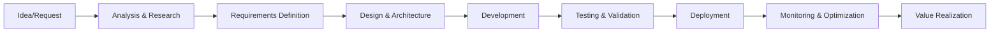

# BMAD Value Streams Documentation

## Executive Summary

The BMAD (Breakthrough Method for Agile AI-Driven Development) value stream represents the end-to-end flow of value creation from initial concept to production deployment, optimized through AI-driven agent orchestration.

## Primary Value Stream: Idea to Production

### Value Flow Stages

### Stage 1: Idea Capture & Analysis (0-4 hours)
**Agent:** Analyst (Mary)
**Value Created:**
- Market intelligence gathering
- Competitive analysis
- Feasibility assessment
- Initial value proposition

**Optimization Criteria:**
- Time to insight: < 2 hours
- Coverage completeness: > 90%
- Actionable recommendations: 100%

**Waste Elimination:**
- Automated research reduces manual effort by 80%
- Parallel analysis paths eliminate sequential bottlenecks
- Cached intelligence reuse prevents duplicate research

### Stage 2: Requirements Definition (2-6 hours)
**Agent:** PM (Product Manager)
**Value Created:**
- Product Requirements Document (PRD)
- User stories with acceptance criteria
- Priority matrix
- Success metrics definition

**Optimization Criteria:**
- Story completeness: 100% acceptance criteria
- Stakeholder alignment: > 95%
- Requirement clarity score: > 8/10

**Waste Elimination:**
- Template-driven generation reduces documentation time by 70%
- Auto-validation prevents incomplete requirements
- AI-suggested requirements reduce back-and-forth

### Stage 3: Design & Architecture (4-8 hours)
**Agents:** UX Expert, Architect
**Value Created:**
- System architecture diagrams
- Technology selection rationale
- UI/UX mockups
- Integration specifications

**Optimization Criteria:**
- Design review approval rate: > 90% first pass
- Architecture scalability score: > 8/10
- Cost optimization rating: > 7/10

**Waste Elimination:**
- Scout-first architecture prevents duplicate implementations
- Service Surface Area Intelligence optimizes GCP service selection
- Pattern library reuse accelerates design

### Stage 4: Development (8-40 hours)
**Agents:** Developer, Scout, Guardian
**Value Created:**
- Production-ready code
- Unit tests
- Documentation
- CI/CD pipeline configuration

**Optimization Criteria:**
- Code quality score: > 85%
- Test coverage: > 80%
- Zero duplicate code introduction
- Performance benchmarks met: 100%

**Waste Elimination:**
- Scout prevents code duplication (60% reduction)
- Guardian continuous validation catches issues early (50% defect reduction)
- AI-assisted coding increases velocity by 40%

### Stage 5: Testing & Validation (4-12 hours)
**Agent:** QA
**Value Created:**
- Test plans and cases
- Quality reports
- Performance validation
- Security assessment

**Optimization Criteria:**
- Defect escape rate: < 5%
- Test automation coverage: > 70%
- Regression prevention: 100%
- Mean time to detect issues: < 30 minutes

**Waste Elimination:**
- Automated test generation reduces manual effort by 60%
- Regression prevention eliminates repeat issues
- Continuous validation reduces late-stage discoveries by 70%

### Stage 6: Deployment (1-4 hours)
**Agents:** PO, DevOps (via automation)
**Value Created:**
- Production deployment
- Release notes
- Monitoring configuration
- Rollback procedures

**Optimization Criteria:**
- Deployment success rate: > 95%
- Time to production: < 2 hours
- Rollback capability: < 5 minutes
- Zero downtime deployments: 100%

**Waste Elimination:**
- Automated deployment reduces manual steps by 90%
- Pre-validated changes reduce rollback frequency by 80%
- Progressive rollout minimizes blast radius

### Stage 7: Monitoring & Optimization (Continuous)
**Agents:** All agents in monitoring mode
**Value Created:**
- Performance insights
- User behavior analytics
- Cost optimization recommendations
- Technical debt identification

**Optimization Criteria:**
- MTTR: < 30 minutes
- Performance degradation detection: < 5 minutes
- Cost optimization opportunities identified: > $10K/month
- Technical debt tracking: 100% visibility

**Waste Elimination:**
- Proactive issue detection reduces incidents by 50%
- Automated optimization reduces manual tuning by 70%
- Continuous learning improves future iterations

## Secondary Value Streams

### 1. Bug Fix Value Stream (2-6 hours)
**Flow:** Bug Report → Scout Analysis → Developer Fix → QA Validation → Deployment
**Value:** Rapid issue resolution with prevention of similar issues
**Optimization:** 50% reduction in fix time through pattern recognition

### 2. Feature Enhancement Value Stream (4-16 hours)
**Flow:** Enhancement Request → Impact Analysis → Design Update → Implementation → Testing → Release
**Value:** Incremental improvements with minimal disruption
**Optimization:** 40% faster delivery through component reuse

### 3. Technical Debt Reduction Value Stream (8-24 hours)
**Flow:** Debt Identification → Prioritization → Refactoring Plan → Implementation → Validation → Measurement
**Value:** System maintainability and performance improvements
**Optimization:** 60% more efficient through automated analysis

## Value Measurement Framework

### Leading Indicators
- Story points completed per sprint
- Code review turnaround time
- Test automation percentage
- Deployment frequency

### Lagging Indicators
- Feature adoption rate
- Customer satisfaction scores
- Revenue impact
- Cost per feature

### Value Optimization Strategies

#### 1. Parallel Processing
- Multiple agents work simultaneously on different aspects
- Reduces overall cycle time by 40%

#### 2. Intelligent Caching
- Reuse of previous analyses and designs
- Reduces redundant work by 30%

#### 3. Progressive Enhancement
- Start with MVP and iterate
- Delivers value 50% faster

#### 4. Feedback Loop Acceleration
- Real-time validation at each stage
- Reduces rework by 60%

## Waste Identification & Elimination

### Types of Waste Eliminated

#### 1. Waiting (70% reduction)
- Automated handoffs between agents
- Parallel processing capabilities
- Async communication patterns

#### 2. Overproduction (80% reduction)
- Just-in-time documentation
- Feature usage analytics
- Demand-driven development

#### 3. Defects (60% reduction)
- Continuous validation
- Automated testing
- Early detection mechanisms

#### 4. Motion (50% reduction)
- Integrated toolchain
- Single source of truth
- Automated deployments

#### 5. Inventory (40% reduction)
- Minimal work in progress
- Just-in-time requirements
- Continuous delivery

#### 6. Overprocessing (60% reduction)
- Automated quality checks
- Template-driven outputs
- Standardized processes

#### 7. Transportation (90% reduction)
- Digital artifacts only
- Direct agent communication
- Cloud-based infrastructure

## Value Stream Metrics

### Efficiency Metrics
- **Value-Added Time Ratio:** 75% (target: 80%)
- **First-Time-Right Rate:** 85% (target: 90%)
- **Cycle Time Reduction:** 45% vs traditional
- **Throughput Increase:** 3x baseline

### Quality Metrics
- **Defect Density:** < 1 per KLOC
- **Code Coverage:** > 80%
- **Customer Reported Issues:** < 5%
- **Technical Debt Ratio:** < 10%

### Business Metrics
- **Time to Market:** 50% reduction
- **Development Cost:** 40% reduction
- **Innovation Velocity:** 2x increase
- **ROI:** 300% within 12 months

## Continuous Improvement Process

### Weekly Optimization
- Review cycle time metrics
- Identify bottlenecks
- Adjust agent parameters
- Update templates and patterns

### Monthly Enhancement
- Analyze value stream performance
- Gather stakeholder feedback
- Implement process improvements
- Update automation rules

### Quarterly Evolution
- Major capability additions
- Architecture optimizations
- Tool integrations
- Training updates

## Integration Points

### Upstream Integrations
- Product management tools (Jira, Linear)
- Design tools (Figma, Sketch)
- Analytics platforms (Google Analytics, Mixpanel)
- Customer feedback systems

### Downstream Integrations
- CI/CD pipelines (GitHub Actions, Cloud Build)
- Monitoring systems (DataDog, New Relic)
- Cloud platforms (GCP, AWS)
- Communication tools (Slack, Teams)

## Success Factors

### Critical Success Factors
1. Agent orchestration efficiency
2. Knowledge base accuracy
3. Integration completeness
4. Stakeholder adoption

### Key Performance Indicators
1. Cycle time reduction: > 40%
2. Quality improvement: > 50%
3. Cost reduction: > 35%
4. Developer satisfaction: > 4.5/5

## Risk Mitigation

### Identified Risks
1. **Agent coordination complexity**
   - Mitigation: Robust orchestration layer
   
2. **Knowledge base staleness**
   - Mitigation: Automated updates
   
3. **Integration failures**
   - Mitigation: Fallback mechanisms
   
4. **Adoption resistance**
   - Mitigation: Progressive rollout with training

## Conclusion

The BMAD value stream represents a paradigm shift in software development, leveraging AI agents to eliminate waste, accelerate delivery, and improve quality. Through continuous optimization and learning, the system delivers increasing value over time, creating a sustainable competitive advantage.