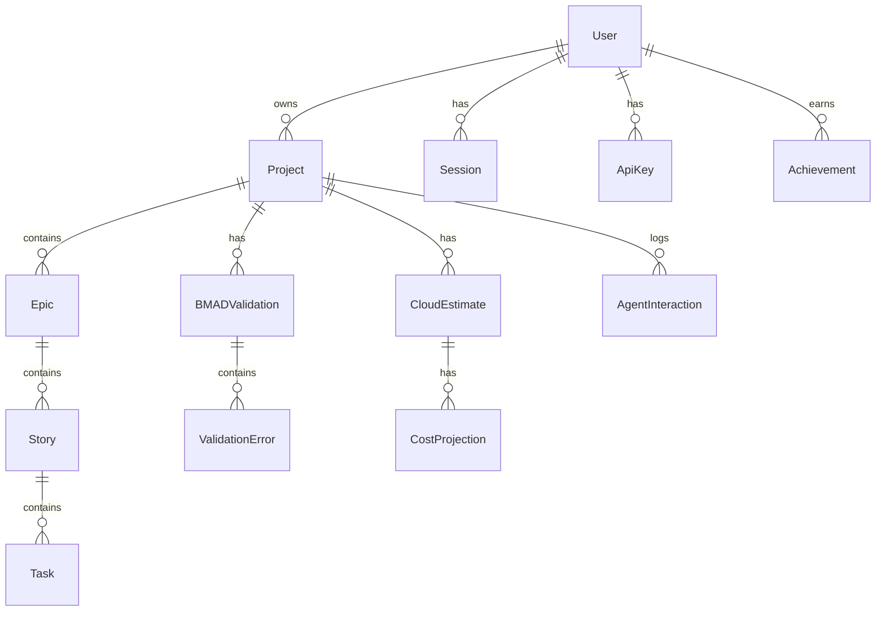

# Data Model Documentation

## Overview
This document describes the data models, database schema, and entity relationships for the Gemini Enterprise Architect system.

## Database Architecture

### Primary Database: PostgreSQL
- **Purpose**: Transactional data, user management, project metadata
- **Version**: 14.x
- **Connection Pool**: 20-100 connections

### Vector Database: Qdrant
- **Purpose**: Semantic search, code embeddings, knowledge base
- **Version**: 1.5.x
- **Collections**: code_embeddings, documentation, knowledge_articles

### Cache Layer: Redis
- **Purpose**: Session management, temporary data, rate limiting
- **Version**: 7.x
- **Eviction Policy**: LRU

## Entity Relationship Diagram



## Core Entities

### User
```sql
CREATE TABLE users (
    id UUID PRIMARY KEY DEFAULT gen_random_uuid(),
    email VARCHAR(255) UNIQUE NOT NULL,
    username VARCHAR(100) UNIQUE NOT NULL,
    password_hash VARCHAR(255) NOT NULL,
    role VARCHAR(50) NOT NULL DEFAULT 'developer',
    created_at TIMESTAMP DEFAULT CURRENT_TIMESTAMP,
    updated_at TIMESTAMP DEFAULT CURRENT_TIMESTAMP,
    last_login TIMESTAMP,
    is_active BOOLEAN DEFAULT true,
    preferences JSONB DEFAULT '{}',
    metadata JSONB DEFAULT '{}'
);

CREATE INDEX idx_users_email ON users(email);
CREATE INDEX idx_users_role ON users(role);
```

### Project
```sql
CREATE TABLE projects (
    id UUID PRIMARY KEY DEFAULT gen_random_uuid(),
    name VARCHAR(255) NOT NULL,
    description TEXT,
    owner_id UUID REFERENCES users(id) ON DELETE CASCADE,
    workspace_path VARCHAR(500),
    repository_url VARCHAR(500),
    status VARCHAR(50) DEFAULT 'active',
    bmad_compliant BOOLEAN DEFAULT false,
    created_at TIMESTAMP DEFAULT CURRENT_TIMESTAMP,
    updated_at TIMESTAMP DEFAULT CURRENT_TIMESTAMP,
    settings JSONB DEFAULT '{}',
    tags VARCHAR(50)[] DEFAULT '{}'
);

CREATE INDEX idx_projects_owner ON projects(owner_id);
CREATE INDEX idx_projects_status ON projects(status);
CREATE INDEX idx_projects_tags ON projects USING GIN(tags);
```

### BMADValidation
```sql
CREATE TABLE bmad_validations (
    id UUID PRIMARY KEY DEFAULT gen_random_uuid(),
    project_id UUID REFERENCES projects(id) ON DELETE CASCADE,
    validation_date TIMESTAMP DEFAULT CURRENT_TIMESTAMP,
    is_valid BOOLEAN NOT NULL,
    score INTEGER CHECK (score >= 0 AND score <= 100),
    errors JSONB DEFAULT '[]',
    warnings JSONB DEFAULT '[]',
    missing_documents TEXT[] DEFAULT '{}',
    recommendations TEXT[] DEFAULT '{}',
    validator_version VARCHAR(20)
);

CREATE INDEX idx_bmad_project ON bmad_validations(project_id);
CREATE INDEX idx_bmad_date ON bmad_validations(validation_date DESC);
```

### Epic
```sql
CREATE TABLE epics (
    id UUID PRIMARY KEY DEFAULT gen_random_uuid(),
    project_id UUID REFERENCES projects(id) ON DELETE CASCADE,
    title VARCHAR(255) NOT NULL,
    description TEXT,
    business_value TEXT,
    status VARCHAR(50) DEFAULT 'draft',
    priority VARCHAR(20) DEFAULT 'medium',
    story_points INTEGER,
    start_date DATE,
    end_date DATE,
    created_at TIMESTAMP DEFAULT CURRENT_TIMESTAMP,
    updated_at TIMESTAMP DEFAULT CURRENT_TIMESTAMP,
    metadata JSONB DEFAULT '{}'
);

CREATE INDEX idx_epics_project ON epics(project_id);
CREATE INDEX idx_epics_status ON epics(status);
```

### Story
```sql
CREATE TABLE stories (
    id UUID PRIMARY KEY DEFAULT gen_random_uuid(),
    epic_id UUID REFERENCES epics(id) ON DELETE CASCADE,
    title VARCHAR(255) NOT NULL,
    user_story TEXT,
    acceptance_criteria JSONB DEFAULT '[]',
    story_points INTEGER,
    status VARCHAR(50) DEFAULT 'backlog',
    assignee_id UUID REFERENCES users(id),
    sprint_id UUID,
    created_at TIMESTAMP DEFAULT CURRENT_TIMESTAMP,
    updated_at TIMESTAMP DEFAULT CURRENT_TIMESTAMP,
    completed_at TIMESTAMP,
    tags VARCHAR(50)[] DEFAULT '{}'
);

CREATE INDEX idx_stories_epic ON stories(epic_id);
CREATE INDEX idx_stories_assignee ON stories(assignee_id);
CREATE INDEX idx_stories_status ON stories(status);
```

### CloudEstimate
```sql
CREATE TABLE cloud_estimates (
    id UUID PRIMARY KEY DEFAULT gen_random_uuid(),
    project_id UUID REFERENCES projects(id) ON DELETE CASCADE,
    environment VARCHAR(50) NOT NULL,
    estimate_date TIMESTAMP DEFAULT CURRENT_TIMESTAMP,
    monthly_cost DECIMAL(10, 2),
    compute_cost DECIMAL(10, 2),
    storage_cost DECIMAL(10, 2),
    network_cost DECIMAL(10, 2),
    currency VARCHAR(3) DEFAULT 'USD',
    usage_data JSONB,
    optimization_opportunities JSONB DEFAULT '[]',
    confidence_level INTEGER CHECK (confidence_level >= 0 AND confidence_level <= 100)
);

CREATE INDEX idx_estimates_project ON cloud_estimates(project_id);
CREATE INDEX idx_estimates_date ON cloud_estimates(estimate_date DESC);
```

### AgentInteraction
```sql
CREATE TABLE agent_interactions (
    id UUID PRIMARY KEY DEFAULT gen_random_uuid(),
    project_id UUID REFERENCES projects(id) ON DELETE CASCADE,
    user_id UUID REFERENCES users(id) ON DELETE CASCADE,
    agent_type VARCHAR(50) NOT NULL,
    request_type VARCHAR(100),
    request_payload JSONB,
    response_payload JSONB,
    processing_time_ms INTEGER,
    tokens_used INTEGER,
    success BOOLEAN DEFAULT true,
    error_message TEXT,
    created_at TIMESTAMP DEFAULT CURRENT_TIMESTAMP
);

CREATE INDEX idx_interactions_project ON agent_interactions(project_id);
CREATE INDEX idx_interactions_user ON agent_interactions(user_id);
CREATE INDEX idx_interactions_agent ON agent_interactions(agent_type);
CREATE INDEX idx_interactions_date ON agent_interactions(created_at DESC);
```

### Achievement
```sql
CREATE TABLE achievements (
    id UUID PRIMARY KEY DEFAULT gen_random_uuid(),
    user_id UUID REFERENCES users(id) ON DELETE CASCADE,
    achievement_type VARCHAR(100) NOT NULL,
    achievement_name VARCHAR(255) NOT NULL,
    description TEXT,
    points INTEGER DEFAULT 0,
    earned_at TIMESTAMP DEFAULT CURRENT_TIMESTAMP,
    metadata JSONB DEFAULT '{}'
);

CREATE INDEX idx_achievements_user ON achievements(user_id);
CREATE INDEX idx_achievements_type ON achievements(achievement_type);
```

## Vector Database Schema

### Code Embeddings Collection
```json
{
  "collection_name": "code_embeddings",
  "vectors": {
    "size": 768,
    "distance": "Cosine"
  },
  "payload_schema": {
    "file_path": "string",
    "function_name": "string",
    "language": "string",
    "project_id": "string",
    "code_snippet": "text",
    "imports": "array",
    "complexity": "number",
    "last_modified": "datetime"
  }
}
```

### Knowledge Base Collection
```json
{
  "collection_name": "knowledge_base",
  "vectors": {
    "size": 768,
    "distance": "Cosine"
  },
  "payload_schema": {
    "document_id": "string",
    "title": "string",
    "content": "text",
    "category": "string",
    "tags": "array",
    "source": "string",
    "created_at": "datetime",
    "relevance_score": "number"
  }
}
```

## Redis Cache Schema

### Session Data
```
Key: session:{session_id}
Type: Hash
Fields:
  - user_id: UUID
  - email: string
  - role: string
  - created_at: timestamp
  - expires_at: timestamp
  - ip_address: string
TTL: 3600 seconds
```

### Rate Limiting
```
Key: rate_limit:{user_id}:{endpoint}
Type: String (counter)
TTL: 60 seconds
```

### Validation Cache
```
Key: bmad_cache:{project_id}:{file_hash}
Type: JSON
TTL: 300 seconds
```

## Data Relationships

### One-to-Many
- User → Projects
- User → Sessions
- User → ApiKeys
- Project → Epics
- Project → BMADValidations
- Epic → Stories
- Story → Tasks

### Many-to-Many
- Users ↔ Teams (via user_teams junction table)
- Projects ↔ Tags (via project_tags junction table)
- Stories ↔ Dependencies (via story_dependencies junction table)

## Data Integrity Constraints

### Foreign Key Constraints
- All foreign keys have ON DELETE CASCADE or RESTRICT as appropriate
- Orphaned records are prevented at database level

### Check Constraints
- Score fields: 0-100 range
- Status fields: Enum validation
- Email fields: Format validation
- URL fields: Format validation

### Unique Constraints
- User email must be unique
- Project name + owner_id combination unique
- API keys must be unique

## Data Migration Strategy

### Version Control
- All schema changes tracked in migration files
- Rollback scripts for each migration
- Version number in database metadata table

### Migration Process
1. Development environment validation
2. Staging environment testing
3. Production backup
4. Production migration during maintenance window
5. Verification and monitoring

## Data Retention Policy

### Retention Periods
- User data: Indefinite while account active
- Project data: 90 days after deletion
- Logs: 30 days
- Cache: 5 minutes to 1 hour
- Sessions: 24 hours

### GDPR Compliance
- Right to erasure implementation
- Data export functionality
- Anonymization procedures
- Audit trail maintenance

## Performance Optimization

### Indexing Strategy
- Primary keys on all tables
- Foreign key indexes
- Frequently queried columns indexed
- Composite indexes for common JOIN patterns
- Full-text search indexes on text fields

### Partitioning
- Time-based partitioning for logs and interactions
- Range partitioning for large tables
- Automatic partition management

### Query Optimization
- Prepared statements for repeated queries
- Query result caching
- Connection pooling
- Read replicas for scaling

---
*Last Updated*: 2025-08-20
*Version*: 1.0
*Database Version*: PostgreSQL 14, Redis 7, Qdrant 1.5