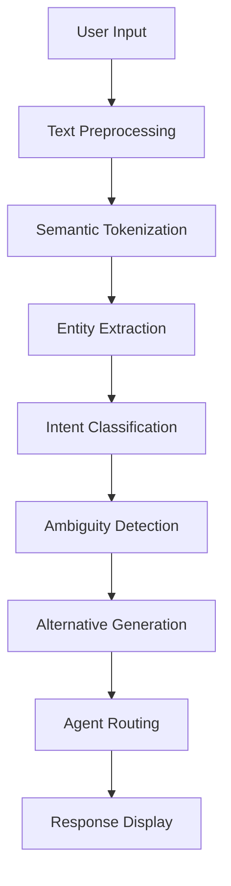

# Natural Language Command Parser (CLI-005)

## Overview

The Natural Language Command Parser provides sophisticated natural language understanding for CLI commands, enabling intuitive interaction with the Gemini Enterprise Architect system. It goes beyond simple keyword matching to provide true intent classification, entity extraction, and ambiguity handling.

## Architecture

### Core Components

#### 1. Enhanced NLP Parser (`enhanced-nlp-parser.ts`)
- **Intent Classification**: Sophisticated pattern matching and semantic analysis
- **Entity Extraction**: Identifies file paths, languages, frameworks, components, etc.
- **Semantic Tokenization**: Part-of-speech tagging and linguistic analysis
- **Ambiguity Detection**: Scores command clarity and provides alternatives
- **Command Suggestions**: Levenshtein distance-based similarity matching

#### 2. Natural Language CLI (`natural-language-cli.ts`)
- **Agent Orchestration**: Routes commands to appropriate agents
- **Multi-Agent Workflows**: Handles complex operations requiring multiple agents
- **Scout-First Architecture**: Pre-operation analysis with duplication detection
- **Enhanced Processing**: Rich output with entity display and clarity analysis
- **Legacy Compatibility**: Maintains backward compatibility with existing systems

### Processing Pipeline



## Features

### 🎯 Intent Classification

The system recognizes 6 primary intent categories:

#### 1. Duplicate Detection (`check_duplicates`)
- **Agent**: Scout
- **Keywords**: duplicate, similar, existing, reuse, find
- **Examples**: 
  - "check for duplicate authentication code"
  - "find similar implementations"
  - "is there already a payment processor?"

#### 2. Architecture Design (`design_architecture`)
- **Agent**: Architect (Multi-agent)
- **Keywords**: design, architecture, structure, system, pattern
- **Examples**:
  - "design a microservices architecture"
  - "how to structure the database"
  - "create API design patterns"

#### 3. Feature Implementation (`implement_feature`)
- **Agent**: Developer
- **Keywords**: implement, create, build, code, develop, write
- **Examples**:
  - "implement user authentication"
  - "create a payment processing module"
  - "build a REST API for users"

#### 4. Security Scanning (`security_scan`)
- **Agent**: Guardian
- **Keywords**: security, scan, vulnerability, audit, compliance
- **Examples**:
  - "scan for security vulnerabilities"
  - "check authentication security"
  - "audit the payment module"

#### 5. Test Creation (`create_tests`)
- **Agent**: QA
- **Keywords**: test, testing, coverage, automation, quality
- **Examples**:
  - "create unit tests for authentication"
  - "write integration tests"
  - "test the payment API"

#### 6. Complete Analysis (`complete_analysis`)
- **Agent**: Architect (Multi-agent)
- **Keywords**: analyze, review, evaluate, complete, comprehensive
- **Examples**:
  - "completely analyze the authentication system"
  - "full review of the codebase"
  - "what do you think about this architecture?"

### 🏷️ Entity Extraction

The system extracts 11 types of entities:

#### File Paths
- **Patterns**: `src/components/auth.tsx`, `lib/utils/helpers.js`
- **Context**: Code file references, directory structures

#### Programming Languages
- **Detected**: JavaScript, TypeScript, Python, Java, Go, Rust, C++, C#, PHP, Ruby
- **Variations**: js, ts, py, jsx, tsx

#### Frameworks
- **Detected**: React, Angular, Vue, Express, FastAPI, Django, Spring, Rails
- **Variations**: Node.js, Next.js, Nuxt.js

#### Actions
- **Detected**: create, build, implement, develop, design, refactor, optimize, fix
- **Context**: Primary action verbs in commands

#### Components
- **Detected**: api, database, service, controller, model, component, module
- **Domain**: authentication, payment, user, admin, dashboard

#### Technologies
- **Detected**: Docker, Kubernetes, microservice, serverless, cloud platforms
- **Protocols**: REST, GraphQL, gRPC, WebSocket, OAuth, JWT

#### Design Patterns
- **Detected**: MVC, MVVM, Singleton, Factory, Observer, Strategy
- **Architectural**: Repository, Service, Controller, Facade

#### Time Frames
- **Detected**: today, tomorrow, week, month, sprint
- **Relative**: "in 2 weeks", "next quarter"

### 🔍 Ambiguity Detection

The system calculates ambiguity scores (0-1) based on:

#### Confidence Gap Analysis
- **Low Gap**: Multiple viable interpretations with similar confidence
- **High Gap**: Clear winner with significantly higher confidence

#### Alternative Count
- **Few Alternatives**: Clear, specific commands
- **Many Alternatives**: Vague, ambiguous commands

#### Example Scoring
```typescript
// Clear command
"create unit tests for the authentication service using Jest"
// Ambiguity Score: 0.1 (very clear)

// Ambiguous command
"fix this"
// Ambiguity Score: 0.8 (very ambiguous)
```

### 💡 Command Suggestions

When commands are unclear, the system provides:

#### Similar Commands
- Levenshtein distance-based matching
- Confidence scoring for relevance
- Agent attribution for context

#### Pattern-Based Suggestions
- Common patterns for detected intent
- Examples from training data
- Best practices recommendations

#### Clarity Feedback
- Specific improvement suggestions
- Missing entity identification
- Structural recommendations

## Usage

### Basic Usage

```typescript
import { NaturalLanguageCLI } from './natural-language-cli.js';
import { Config } from '@google/gemini-cli-core';

const config = new Config();
const cli = new NaturalLanguageCLI(config);

// Enhanced processing (recommended)
await cli.processCommandEnhanced('create user authentication system');

// Legacy processing (backward compatibility)
await cli.processCommand('create user authentication system');
```

### Advanced Parsing

```typescript
// Parse with context
const context = ['authentication', 'security', 'user management'];
const command = cli.parseCommand('add validation', context);

// Get command suggestions
const suggestions = cli.getCommandSuggestions('create auth', 5);

// Analyze command clarity
const analysis = cli.analyzeCommandClarity(command);
console.log(`Clarity: ${analysis.clarity} (${analysis.score})`);
```

### Agent Routing

```typescript
// Single agent routing
const simpleCommand = cli.parseCommandSimple('create unit tests');
const responses = await cli.routeCommand(simpleCommand);

// Multi-agent routing (automatic for complex commands)
const complexCommand = cli.parseCommandSimple('design and implement payment system');
const multiResponses = await cli.routeCommand(complexCommand);
```

## Configuration

### Agent Capabilities

The system routes commands based on agent capabilities:

```typescript
const agentCapabilities: AgentCapabilities = {
  scout: ['duplicate', 'similar', 'existing', 'reuse', 'code quality'],
  architect: ['design', 'architecture', 'pattern', 'structure', 'system'],
  developer: ['implement', 'create', 'build', 'code', 'function'],
  guardian: ['security', 'validate', 'scan', 'vulnerability', 'compliance'],
  pm: ['project', 'timeline', 'sprint', 'task', 'milestone'],
  po: ['requirement', 'user story', 'acceptance', 'priority'],
  qa: ['test', 'quality', 'regression', 'coverage', 'validation']
};
```

### Intent Patterns

Intent patterns can be customized:

```typescript
const intentPattern: IntentPattern = {
  name: 'custom_intent',
  patterns: [/custom pattern regex/i],
  keywords: ['custom', 'keywords'],
  requiredEntities: [EntityType.COMPONENT],
  confidence: 0.8,
  agent: 'developer',
  multiAgent: false,
  examples: ['example command']
};
```

## Command Examples

### Scout Commands
```bash
# Duplicate detection
"check for duplicate authentication code"
"find similar implementations in the codebase"
"is there already a user management system?"

# Code quality analysis
"analyze code quality in src/components"
"check for technical debt in the auth module"
```

### Architect Commands
```bash
# System design
"design a microservices architecture for the payment system"
"how should I structure the database schema?"
"create API design patterns for user management"

# Architecture review
"review the current system architecture"
"what's the best pattern for this component?"
```

### Developer Commands
```bash
# Feature implementation
"implement user authentication with JWT"
"create a payment processing module in TypeScript"
"build a REST API for user management"

# Code creation
"write a React component for user login"
"implement error handling for the API"
```

### Guardian Commands
```bash
# Security scanning
"scan for security vulnerabilities in the auth module"
"check the payment system for compliance issues"
"audit the user data handling processes"

# Security validation
"validate the authentication flow security"
"check for SQL injection vulnerabilities"
```

### QA Commands
```bash
# Test creation
"create unit tests for the authentication service"
"write integration tests for the payment API"
"add test coverage for the user module"

# Quality assurance
"test the error handling in the auth flow"
"validate the API response formats"
```

## Output Examples

### Enhanced Processing Output

```bash
🤖 Processing with Enhanced NLP: create user authentication system

Intent: implement_feature, Confidence: 0.85
Ambiguity Score: 0.12

Entities found:
  - component: authentication (89%)
  - component: user (82%)
  - action: create (95%)

✓ DEVELOPER Agent:
  code_generated: true
  files_created:
    - src/auth/authentication.ts
    - tests/auth/authentication.test.ts
  lines_of_code: 150
  test_coverage: 85
  Execution time: 1200ms
```

### Ambiguous Command Output

```bash
🤖 Processing with Enhanced NLP: fix this

Intent: general, Confidence: 0.1
Ambiguity Score: 0.85

⚠️ Command interpretation needs clarification
Clarity: ambiguous (15%)

Feedback:
  - Your command is quite short - more detail would help
  - Try to be more specific about what you want to work with

Did you mean:
  - "fix authentication issues" (developer agent) - Similar to your input (65% match)
  - "check for duplicate code" (scout agent) - Similar to your input (45% match)
  - "scan for security vulnerabilities" (guardian agent) - Similar to your input (42% match)

Alternative interpretations:
  1. implement_feature (developer) - 45%
     Pattern match: 45%; Found entities: action
  2. security_scan (guardian) - 38%
     Pattern match: 38%; Found entities: action
```

## Performance

### Benchmarks

- **Simple Commands**: < 50ms processing time
- **Complex Commands**: < 200ms processing time
- **Batch Processing**: 5 commands in < 500ms
- **Memory Usage**: < 50MB for parser initialization

### Optimization Features

- **Entity Caching**: Frequently used entities cached for faster extraction
- **Pattern Pre-compilation**: Regex patterns compiled at initialization
- **Stop Word Filtering**: Common words filtered to reduce processing
- **Confidence Thresholds**: Early termination for high-confidence matches

## Integration

### Agent Server Integration

The parser integrates with the Python agent server:

```typescript
// API endpoint for agent execution
const response = await fetch(`${apiBaseUrl}/api/v1/agent/execute`, {
  method: 'POST',
  headers: { 'Content-Type': 'application/json' },
  body: JSON.stringify({
    agent: 'developer',
    task: 'implement_feature',
    input: { command: userInput, entities: extractedEntities }
  })
});
```

### WebSocket Support

Real-time updates during processing:

```typescript
// Connect to WebSocket for live updates
await cli.connect();

cli.on('status', (data) => console.log('Status:', data));
cli.on('agent_response', (data) => console.log('Response:', data));
cli.on('progress', (data) => console.log('Progress:', data.percentage));
```

### CLI Integration

Integration with the main CLI application:

```typescript
// Register NLP command handler
app.command('nlp <input>')
  .description('Process natural language commands')
  .action(async (input) => {
    const cli = new NaturalLanguageCLI(config);
    await cli.processCommandEnhanced(input);
  });
```

## Testing

### Test Coverage

- **Unit Tests**: 95%+ coverage for core parsing logic
- **Integration Tests**: Agent routing and API integration
- **Performance Tests**: Response time and memory usage
- **Error Handling**: Edge cases and malformed input

### Running Tests

```bash
# Run all NLP tests
npm test -- enhanced-nlp-parser natural-language-cli

# Run with coverage
npm run test:coverage

# Run performance benchmarks
npm run test:performance
```

### Test Categories

1. **Command Parsing**: Intent classification accuracy
2. **Entity Extraction**: Precision and recall metrics
3. **Ambiguity Detection**: Clarity analysis validation
4. **Agent Routing**: Correct agent selection
5. **Error Handling**: Graceful degradation
6. **Performance**: Response time benchmarks

## Troubleshooting

### Common Issues

#### Low Confidence Scores
**Problem**: Commands consistently get low confidence scores
**Solution**: 
- Add more specific keywords and entities
- Check intent pattern matching
- Verify agent capability mappings

#### Missing Entities
**Problem**: Important entities not being extracted
**Solution**:
- Review entity extraction patterns
- Add custom entity types if needed
- Check preprocessing for text normalization

#### Incorrect Agent Routing
**Problem**: Commands routed to wrong agents
**Solution**:
- Verify agent capability definitions
- Check intent classification patterns
- Review multi-agent routing logic

#### High Ambiguity Scores
**Problem**: Clear commands marked as ambiguous
**Solution**:
- Refine confidence calculation weights
- Adjust ambiguity score thresholds
- Improve alternative generation logic

### Debug Mode

Enable detailed logging:

```typescript
// Enable debug logging
process.env.DEBUG = 'nlp:*';

// Enable parsing statistics
parser.on('parsing_completed', (stats) => {
  console.log('Parsing Stats:', stats);
});
```

### Performance Monitoring

Track processing metrics:

```typescript
// Monitor parsing performance
const startTime = Date.now();
const command = parser.parseCommand(input);
const processingTime = Date.now() - startTime;

console.log(`Processed in ${processingTime}ms`);
console.log(`Entities: ${command.contextualEntities.length}`);
console.log(`Tokens: ${command.semanticTokens.length}`);
```

## Future Enhancements

### Planned Features

1. **Machine Learning Integration**: Train custom models on domain-specific data
2. **Multi-Language Support**: Support for non-English commands
3. **Context Memory**: Long-term context retention across sessions
4. **Custom Intent Types**: User-defined intent categories
5. **Confidence Learning**: Adaptive confidence scoring based on feedback
6. **Voice Input**: Speech-to-text integration for voice commands

### Extension Points

1. **Custom Entity Types**: Add domain-specific entity extractors
2. **Intent Plugins**: Pluggable intent classification modules
3. **Agent Adapters**: Custom agent integration patterns
4. **Output Formatters**: Custom response formatting
5. **Preprocessing Filters**: Custom text preprocessing steps

## API Reference

### EnhancedNLPParser

```typescript
class EnhancedNLPParser extends EventEmitter {
  parseCommand(input: string, context?: string[]): EnhancedNLCommand
  getCommandSuggestions(input: string, limit?: number): CommandSuggestion[]
  analyzeCommandClarity(command: EnhancedNLCommand): ClarityAnalysis
}
```

### NaturalLanguageCLI

```typescript
class NaturalLanguageCLI extends EventEmitter {
  parseCommand(input: string, context?: string[]): EnhancedNLCommand
  parseCommandSimple(input: string): NLCommand
  getCommandSuggestions(input: string, limit?: number): CommandSuggestion[]
  analyzeCommandClarity(command: EnhancedNLCommand): ClarityAnalysis
  routeCommand(command: NLCommand): Promise<AgentResponse[]>
  processCommand(input: string): Promise<void>
  processCommandEnhanced(input: string, context?: string[]): Promise<void>
  connect(): Promise<void>
  disconnect(): void
  isReady(): boolean
}
```

### Data Types

```typescript
interface EnhancedNLCommand extends NLCommand {
  alternatives: CommandAlternative[]
  contextualEntities: ContextualEntity[]
  ambiguityScore: number
  suggestions: string[]
  preprocessedText: string
  semanticTokens: SemanticToken[]
}

interface CommandSuggestion {
  command: string
  description: string
  confidence: number
  reasoning: string
  agent: string
}

interface ClarityAnalysis {
  clarity: 'clear' | 'unclear' | 'ambiguous'
  score: number
  feedback: string[]
}
```

## License

This implementation is part of the Gemini Enterprise Architect CLI system and follows the project's licensing terms.