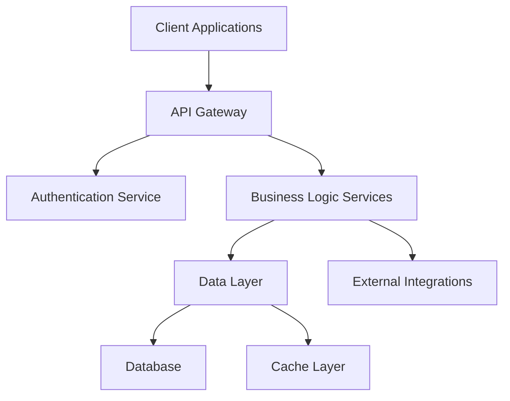
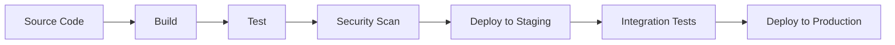

# Enterprise Architecture Review: Enterprise Project

*Generated on 2025-08-21 using Swarm Documentation Service v2.0*

---


## Executive Summary

### Project Overview
- **Project Name:** Enterprise Project
- **Business Domain:** Technology
- **Project Type:** enterprise
- **Date:** 2025-08-21

### Business Problem
The Enterprise Project project addresses critical business needs in the Technology domain. This enterprise initiative is designed to deliver strategic value through modern technology solutions.

### Proposed Solution
A comprehensive full-stack solution that leverages industry best practices and modern architecture patterns to deliver scalable, secure, and maintainable business value.

### Key Benefits
- Enhanced operational efficiency through automation
- Improved user experience and customer satisfaction
- Reduced operational costs and technical debt
- Increased scalability and future-proofing
- Better compliance and security posture

## Business Context

### Business Drivers
- **Strategic Alignment:** Support organizational digital transformation goals
- **Operational Excellence:** Streamline business processes and reduce manual overhead
- **Competitive Advantage:** Leverage technology for market differentiation
- **Risk Mitigation:** Address security and compliance requirements

### Stakeholders
| Role | Stakeholder | Responsibilities |
|------|-------------|------------------|
| Business | Product Owner | Business requirements and approval |
| Business | Business Analyst | Business requirements and approval |
| Technical | Solution Architect | Technical implementation and architecture |
| Technical | Lead Developer | Technical implementation and architecture |
| External | Security Auditor | External integration and compliance |
| External | Compliance Officer | External integration and compliance |


## Technical Solution

### Architecture Overview
The Enterprise Project follows a modern microservices architecture pattern, designed for scalability, maintainability, and security.

#### High-Level Architecture


### Technology Stack

- **Frontend:** React/TypeScript with modern build tools
- **Backend:** Node.js/Express with microservices architecture
- **Database:** PostgreSQL with Redis caching
- **Infrastructure:** Docker containers on Kubernetes
- **Monitoring:** Prometheus/Grafana with centralized logging

### Integration Points
- **Internal Integrations:** Microservices communication via REST APIs and event-driven messaging
- **External Integrations:** Third-party APIs with proper authentication and rate limiting
- **Data Integration:** ETL pipelines for data synchronization and transformation

### Scalability Considerations
- Horizontal scaling capabilities for all service tiers
- Load balancing and auto-scaling configurations
- Database sharding and read replicas for performance optimization
- CDN integration for static content delivery


## Risk Assessment

### Technical Risks

#### High Priority Risks
1. **Data Migration Complexity**
   - **Risk:** Complex data transformation and migration processes
   - **Impact:** Project delays and data integrity issues
   - **Mitigation:** Comprehensive data mapping, incremental migration strategy, extensive testing

2. **Integration Challenges**
   - **Risk:** Difficulties integrating with legacy systems
   - **Impact:** Functional gaps and performance issues
   - **Mitigation:** API-first design, adapter patterns, thorough integration testing

3. **Scalability Limitations**
   - **Risk:** System performance under high load
   - **Impact:** Poor user experience and system failures
   - **Mitigation:** Performance testing, auto-scaling, load balancing

#### Medium Priority Risks
1. **Technology Adoption**
   - **Risk:** Team learning curve with new technologies
   - **Impact:** Development delays and quality issues
   - **Mitigation:** Training programs, mentoring, proof of concepts

2. **Third-party Dependencies**
   - **Risk:** External service outages or changes
   - **Impact:** System downtime and functionality loss
   - **Mitigation:** Circuit breakers, fallback strategies, vendor diversification

### Business Risks
1. **Stakeholder Alignment**
   - **Risk:** Changing requirements and scope creep
   - **Impact:** Budget overruns and timeline delays
   - **Mitigation:** Regular stakeholder reviews, change management process

2. **Resource Availability**
   - **Risk:** Key personnel unavailability
   - **Impact:** Project delays and knowledge gaps
   - **Mitigation:** Cross-training, documentation, resource planning


## Security and Compliance

### Security Architecture
The security architecture follows a high-security model with comprehensive protection at all layers.


### Authentication & Authorization
- Multi-factor authentication (MFA) for all users
- Identity federation with enterprise SSO
- Attribute-based access control (ABAC)
- Zero-trust network architecture principles

### Data Protection
- Hardware Security Module (HSM) for key management
- End-to-end encryption for sensitive data
- Advanced threat protection and anomaly detection
- Data loss prevention (DLP) policies

### Compliance Framework
The system must comply with the following regulations:
- SOC 2
- GDPR

### Data Protection
- **Data Classification:** Sensitive data identification and labeling
- **Encryption:** Data at rest and in transit encryption using industry standards
- **Access Controls:** Role-based access with principle of least privilege
- **Audit Logging:** Comprehensive logging for security monitoring and compliance

### Security Monitoring
- **SIEM Integration:** Security Information and Event Management
- **Vulnerability Scanning:** Regular automated security assessments
- **Penetration Testing:** Annual third-party security assessments
- **Incident Response:** Defined procedures for security incident handling


## Operational Readiness

### Deployment Strategy
- **Environment Strategy:** Development, Staging, Production environments
- **Deployment Method:** Blue-green deployment with automated rollback capabilities
- **Release Cadence:** Bi-weekly releases with hotfix capability

### CI/CD Pipeline


### Monitoring and Observability
- **Application Monitoring:** Performance metrics, error tracking, and alerting
- **Infrastructure Monitoring:** Server health, resource utilization, and capacity planning
- **Log Management:** Centralized logging with search and analysis capabilities
- **Distributed Tracing:** End-to-end request tracking for troubleshooting

### Support Model
- **Level 1 Support:** Basic user support and issue triage
- **Level 2 Support:** Technical analysis and system troubleshooting
- **Level 3 Support:** Deep technical investigation and code fixes
- **Escalation Procedures:** Defined escalation paths for critical issues

### Service Level Agreements (SLAs)
- **Availability:** 99.9% uptime during business hours
- **Performance:** Response time < 2 seconds for standard operations
- **Recovery Time:** Maximum 4 hours for critical system recovery
- **Support Response:** 1 hour for critical issues, 4 hours for high priority


## Project Management

### Project Timeline
```mermaid
gantt
    title Project Timeline
    dateFormat  YYYY-MM-DD
    section Implementation
    Requirements Analysis    :2 weeks
    Architecture Design    :3 weeks
    Implementation    :6 weeks
    Testing & Deployment    :1 week
```

### Resource Allocation
- **Development Team:** Full-stack developers, specialized in chosen technology stack
- **DevOps Engineer:** Infrastructure automation and deployment pipeline management
- **Security Specialist:** Security architecture and compliance oversight
- **Quality Assurance:** Test automation and quality validation
- **Project Manager:** Timeline coordination and stakeholder communication

### Communication Plan
- **Daily Standups:** Development team coordination and blocker identification
- **Weekly Status Updates:** Stakeholder progress reporting
- **Sprint Reviews:** Bi-weekly feature demonstrations and feedback
- **Monthly Steering Committee:** Executive oversight and strategic decisions

### Risk Mitigation Timeline
- **Week 1-2:** Architecture validation and proof of concepts
- **Week 3-4:** Development environment setup and initial integration testing
- **Week 5-8:** Core functionality development with continuous testing
- **Week 9-10:** Security review and penetration testing
- **Week 11-12:** Performance testing and production readiness validation

### Success Criteria
- All functional requirements implemented and tested
- Security and compliance requirements validated
- Performance benchmarks achieved
- Stakeholder acceptance and sign-off
- Production deployment completed successfully


---

## Appendix

### Document Metadata
- **Generation Method:** Multi-Agent Swarm Collaboration
- **Template Version:** 2.0.0
- **Agents Involved:** business-value-analyst, architect, scout, guardian, devops-engineer, project-manager
- **Average Confidence:** 89.7%
- **Swarm Session ID:** doc_swarm_1755793741906

### Quality Assurance
This document has been generated using AI-powered multi-agent collaboration to ensure comprehensive coverage of all architectural aspects. Each section has been analyzed by specialized agents with domain expertise.

### Next Steps
1. **Review and Validation:** Stakeholder review of all sections
2. **Technical Validation:** Architecture review board assessment
3. **Implementation Planning:** Detailed project planning based on this architecture
4. **Risk Mitigation:** Address identified risks before implementation begins

---

*This document serves as the foundation for project approval and implementation planning. All stakeholders should review and provide feedback before proceeding with development.*